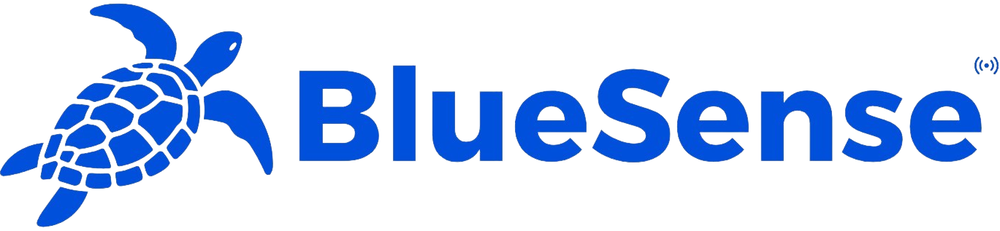

<div align="center">
  
</div>

<p align="center">
  
  
  
  
  
</p>

<p align="center">
  <a href="#about">Sobre</a> • 
  <a href="#started">Começando</a> • 
  <a href="#colab">Colaboradores</a>
</p>

<h2 id="about">📌 Sobre</h2>

Seja bem-vindo ao BlueSense, um app focado na conscientização da vida marinha.

<h2 id="started">🚀 Começando</h2>

<h3>Pré-requisitos</h3>


 OU 


<h3>Rodando</h3>

Como rodar o projeto:

```bash
#Primeiro vamos clonar ele
git clone https://github.com/nichol6s/bluesense-app.git

#Entrando na pasta
cd bluesense-app

#Instale as dependências:
npm install

#Rode o projeto expo:
npx expo start
```

<h3>Abrindo</h3>

Temos duas formas de abrir o projeto:
- Android Studio

  ```bash
  #Depois de rodar o comando: npx expo start
  #Pressione a letra "A" no terminal e ele irá abrir o projeto no emulador do android studio
  ```
- Expo Go 
  ```bash
  #Instale o app "Expo Go" no seu celular
  #Escaneie o QRCode que aparece no terminal
  ```
<h1 id="colab">🤝 Colaboradores</h2>
<table>
  <tr>
    <td align="center">
      <p>Mobile & IA</p>
      <a href="https://github.com/nichol6s">
        <br>
        <sub>
          <strong>Nicholas Santos</strong>
        </sub>
      </a>
    </td>
    <td align="center">
      <p>C#</p>
      <a href="https://github.com/VitorKubica">
        <br>
        <sub>
          <strong>Vitor Kubica</strong>
        </sub>
      </a>
    </td>
    <td align="center">
      <p>Database & Compliance</p>
      <a href="https://github.com/DuduViolante">
        <br>
        <sub>
          <strong>Eduardo Violante</strong>
        </sub>
      </a>
    </td>
    <td align="center">
      <p>Java</p>
      <a href="https://github.com/pedrocpacheco">
        <br>
        <sub>
          <strong>Pedro</strong>
        </sub>
      </a>
    </td>
    <td align="center">
        <p>DevOps</p>
        <a href="https://github.com/biasvestka">
        <br>
        <sub>
            <strong>Beatriz Svestka</strong>
        </sub>
      </a>
    </td>
  </tr>
</table>

Join our community of developers creating universal apps.

- [Expo on GitHub](https://github.com/expo/expo): View our open source platform and contribute.
- [Discord community](https://chat.expo.dev): Chat with Expo users and ask questions.
